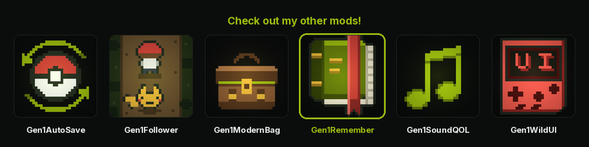

<p align="center">
  <a href="https://wild1walker.github.io/Gen1Wild/"></a>
</p>

<h1 align="center">Gen1Remember</h1>

<p align="center">
  <a href="https://wild1walker.github.io/Gen1Wild/"></a>
</p>

**A POKéMON can be taught a move it has forgotten.**

A mod for [Gen1Recomp](https://github.com/bryanthaboi/gen1recomp).

Gen 1 has no move reminder. A move that scrolled off the top of the four slots
on the way up is gone for the rest of the save, and the only thing the
cartridge ever offers back is a TM you have to own. Your BLASTOISE forgot
BUBBLE at some point between Pallet Town and here and there is no counter
anywhere in the game that will give it back.

This adds a **REMEMBER** row to the popup you already open on a POKéMON, lists
what it should already have had, and teaches the one you pick.

## Install

**MODS > FIND MODS**, add the index `wild1walker/Gen1Wild`, and install
Gen1Remember from the card. Or download the `.zip` from
[Releases](https://github.com/wild1walker/Gen1Remember/releases) and use
**MODS > Import mod .zip**.

## Where the row is

| Surface | How |
|---|---|
| **The party menu** | The per-POKéMON popup — the one with STATS and SWITCH on it. REMEMBER goes under them. |
| **The box** | The popup START opens over a POKéMON in [Gen1BillsBox](https://github.com/wild1walker/Gen1BillsBox), between that screen's own verbs and CANCEL. Needs Gen1BillsBox **1.2.0 or newer**. |

Not in battle. The submenu there is SWITCH / STATS / CANCEL, and a move learned
mid-turn is a mechanic rather than a convenience — which is a different mod.

The vanilla Bill's PC popup does not get the row: `src/ui/BoxMenu.lua` builds
its rows privately and there is no hook on it. Gen1BillsBox replaces that
screen anyway, which is where the box half of this mod lives.

## What it offers back

Every **level-up move** the POKéMON should already have had at the level it has
reached, minus the four it knows now. Each row names the move and the level it
comes in at, and the list is ordered by that level.

**The forms it evolved out of count.** A CHARIZARD's learnset is CHARIZARD's;
the moves it learned as a CHARMANDER are in CHARMANDER's, and a player who
evolved past EMBER did not stop having forgotten it. So the evolution chain is
walked backwards and every form's learnset counted, on the same level test.

**TM and HM moves are not offered.** A machine move is not forgotten, it is
bought: you still have the TM, or you knowingly spent it. Handing those back
free would quietly rewrite what a TM costs. Level-up moves are the ones the
game took away without asking.

## Picking one

- **Under four moves** — it goes straight into the free slot, with the same
  `LearnedMove1Text` and jingle the bag's TM path uses. One event should sound
  the same however it was started.
- **Four moves** — the engine's own **MoveLearnMenu** takes over: "Delete an
  older move to make room?", the forget list, the HM refusal, and "1, 2
  and... Poof!". Every one of those is text you already know, and a mod that
  redrew them would get one of them subtly wrong. It is reached through
  `Screens.push`, so a mod that has *replaced* that screen — a translation, a
  UI overhaul — is the one that answers here too.

B backs out of the popup, and out of the learn flow, exactly where the vanilla
screens let you.

## Settings

| Setting | Default | What it does |
|---|---|---|
| `PARTY REMEMBER` | on | The row in the party menu's popup. |
| `BOX REMEMBER` | on | The row in Gen1BillsBox's popup. Inert without that mod installed — a toggle that turns nothing off beats one that appears and disappears with another mod. |
| `PRE-EVO MOVES` | on | Count the forms this POKéMON evolved out of. Off reads the current form's learnset alone, which is the later-generation move reminder's rule, for anyone who wants evolving to be a door that shuts. |
| `HIDE WHEN EMPTY` | on | A POKéMON with nothing to remember carries no row at all. Off leaves the row everywhere and has it say so instead, which keeps the popup the same shape on every POKéMON. |

## Nothing is written to your save

The list is **derived**, not recorded. Gen 1 keeps no move history — a save
records the four moves a POKéMON has and not one byte about what it used to
know — so "the moves it has forgotten" cannot be read back and has to be worked
out. What this offers is exactly the set `Pokemon.movesAtLevel` threw away on
the way up: it keeps the most recent four and drops the rest.

Which is the reason to prefer deriving it over recording what got overwritten:

- A POKéMON **caught before this mod was installed** answers exactly the same
  as one caught after.
- A save that has never seen this mod **loses nothing by adding it**, and
  nothing by removing it again.
- There is no state to migrate, corrupt, or disagree with the save.

The cost is the honest one: a TM move a POKéMON learned and then overwrote is
not offered back, because nothing records that it ever had it. That is also the
call this mod would make *with* a record available, for the reason above.

## Known differences

- **A pre-evolution's move is gated on the POKéMON's current level**, not on
  the level it evolved at — so a form that evolved early can still be given a
  move its pre-evolution learns later. The alternative needs the level a
  POKéMON evolved at, which the save does not carry either.
- **The popup is a `Menu`, not a screen of its own.** `Menu` already has the
  blinking cursor, the wrap, the scroll window and the B-to-close every vanilla
  popup has, and it grows its frame to the widest label so a long or translated
  move name does not overflow. A hand-rolled list would be a second
  implementation of all of that, one that drifts.
- **The row is appended, not inserted.** The order at the front of the party
  submenu is load bearing: `DisplayFieldMoveMonMenu` indexes `wFieldMoves` with
  menu items `0..n-1`, so the field moves have to stay at the top and STATS /
  SWITCH at the bottom of what the engine built. The end of the list is the one
  place a new row is free.
- **A move a learnset names but the dataset does not carry is skipped**, rather
  than offered as a blank row that would teach a slot the battle engine cannot
  resolve.
- **Teaching a move the POKéMON already knows is refused**, not duplicated: the
  battle engine indexes moves by slot, and two slots naming one move is a state
  no vanilla path can produce.
- **A cycle in the evolution table** — a content mod's mistake — terminates the
  chain walk rather than hanging the party menu. The walk is breadth-first with
  a visited set, so every species is reached once and any graph terminates.

## Compatibility

- The party row is the engine's own `ui.party.submenu` hook, which dispatches a
  hook-injected row by calling its `onSelect`. `next()` is called first and the
  result decorated, so **another mod's row on that popup survives**.
- The box row is Gen1BillsBox's published extension point, registered at
  `game.ready` rather than at load — so **either install order works**, and a
  hot reload replaces the registration rather than stacking a stale one.
- No screen is replaced and no engine function is patched, so a mod that has
  claimed the party menu, the box or `MoveLearnMenu` keeps it.

## For other mods

The pool is a pure function of the dataset and one POKéMON, published so a mod
can ask what one has forgotten without opening a screen:

```lua
local r = mod.find("Gen1Remember")
if r then
  local pool = r.exports.pool(game.data, mon)   -- { { move, name, level, species, inherited }, ... }
  local chain = r.exports.chain(game.data, mon.species)  -- form, then what it evolved from
  if r.exports.any(game.data, mon) then ... end

  r.exports.open(game, mon, function() ... end)          -- the popup
  r.exports.teach(game, mon, "EMBER", function(learned) ... end)
end
```

`pool` and `chain` take a dataset rather than a game, so they can be driven
against hand-built species — which is what the suite does.

## Development

```sh
git clone https://github.com/bryanthaboi/gen1recomp engine
git clone https://github.com/wild1walker/Gen1Remember engine/mods/Gen1Remember
git clone https://github.com/wild1walker/Gen1BillsBox engine/mods/Gen1BillsBox
cd engine
luajit mods/Gen1Remember/tests/gen1remember_test.lua
luajit mods/Gen1Remember/tests/box_test.lua
python3 tools/modkit.py validate mods/Gen1Remember
python3 tools/modkit.py lint mods/Gen1Remember
```

Both suites run headlessly against the ROM-free fixture dataset, so neither
needs a ROM. `box_test.lua` loads Gen1Remember and Gen1BillsBox together —
the seam is somebody else's export and a stub of it would only prove this mod
can call a stub — and **skips itself rather than failing** when Gen1BillsBox is
not beside the checkout.

## Credits

- [pret](https://github.com/pret)'s pokered disassembly, which is where the
  learn-move flow and its text are read out of.
- [Gen1Recomp](https://github.com/bryanthaboi/gen1recomp), and its
  `ui.party.submenu` hook — this mod is a row on somebody else's popup, twice
  over, and neither of them had to be patched to allow it.

MIT. The wordmark at the top is shared with the rest of
[Gen1Wild](https://github.com/wild1walker/Gen1Wild).
